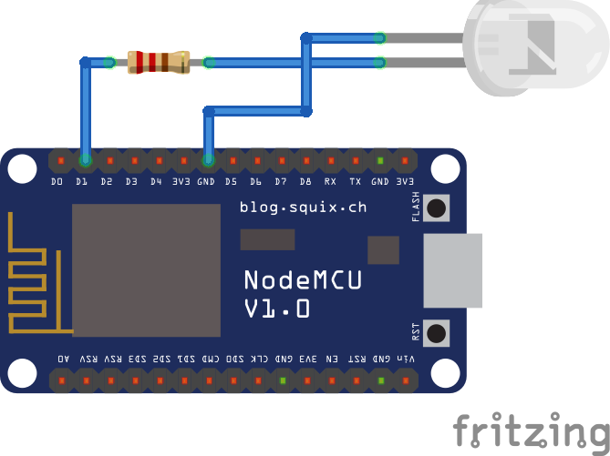

# Kontrol Lampu Menggunakan Android

Mengontrol led melalui aplikasi android, melalui wifi. Aplikasi android dibuat menggunakan Flutter. Mikrokontroler menggunakan nodemcu.

## Rangkaian PWM nodemcu dan led

[Koding dan rangkaian arduino](https://github.com/haryandb/flutter_lamp/tree/master/arduino)
